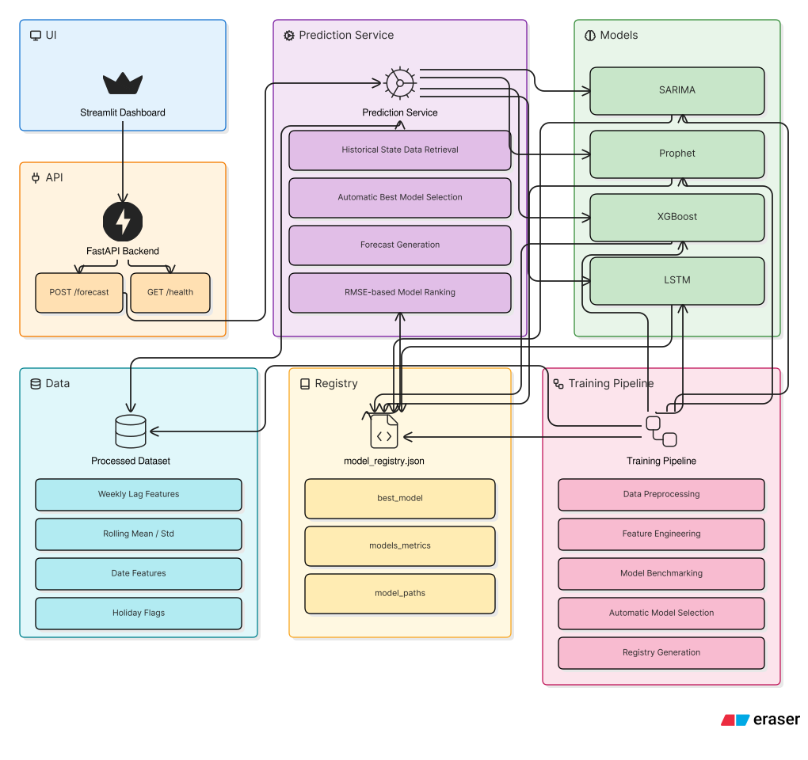
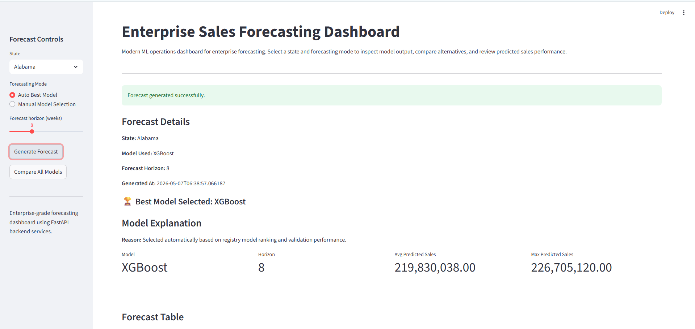
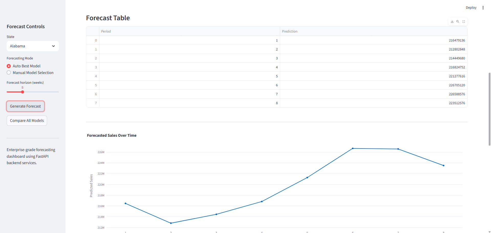
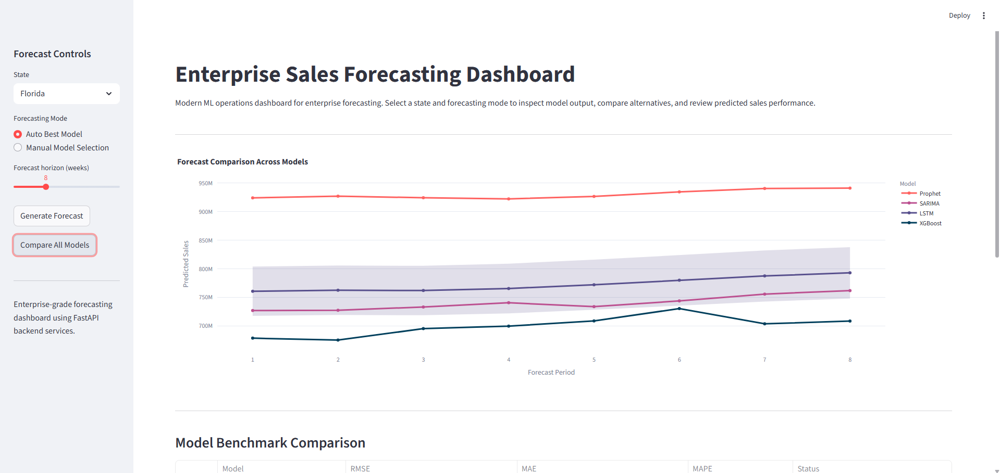
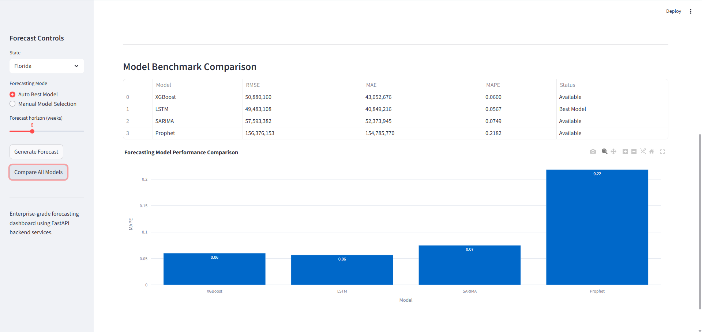

# Enterprise Sales Forecasting System

## Overview
This repository implements a production-ready forecasting system for weekly sales across U.S. states. The solution is designed as a real backend service with **modular, object-oriented architecture, model comparison, automatic best-model selection, REST API serving, and Streamlit dashboard visualization.**

## Problem Statement
Forecast the next **8 weeks** of sales for each state using historical weekly sales data from the attached dataset.

## USP of the Project
The **Object Oriented Architecture** is implemented in such a way that it can be expanded very easily to add more features or models to the project, creating **modular and maintainable code**. Furthermore, the use of **Streamlit** provides a **user friendly interface** for the end users to interact with the system.

## Key Requirements Addressed
- Trains multiple forecasting algorithms
- Compares candidate models and selects the best-performing model automatically
- Exposes predictions through a REST API
- Uses a production-style backend service design
- Handles missing dates and missing values
- Supports seasonality, trend, and holiday effects
- Implements feature engineering, time-series split, and OOP design

## Mandatory Models Implemented
- **SARIMA** (seasonal ARIMA)
- **Facebook Prophet**
- **XGBoost** with lag features
- **LSTM** deep learning model

## Feature Engineering
The feature engineering pipeline includes:
- Lag features: `t-1`, `t-7`, `t-30`
- Rolling statistics: mean and standard deviation
- Date features: month, week of year, quarter
- Holiday flag for U.S. holidays

## Architecture



### Architecture Summary
- `Streamlit Dashboard` provides interactive controls and result visualization.
- `FastAPI Backend` exposes `/forecast` and `/health` endpoints.
- `PredictionService` loads models, generates features, and forecasts future periods.
- `DataPipeline` preprocesses raw data and constructs weekly time series.
- `ModelRegistry` persists model metrics and stores the selected best model per state.

## Dataset
The dataset is sourced from the attached case study file:
- `data/Forecasting Case- Study.xlsx - Sheet1.csv`

The project processes this data into weekly sales records and saves the cleaned dataset at:
- `data/processed/processed_timeseries.csv`

## What the Project Does
1. **Data Preprocessing**
   - Cleans raw input data
   - Aggregates sales by week
   - Fills missing weekly dates with linear interpolation
   - Adds engineered features for time series modeling

2. **Training and Evaluation**
   - Trains each required model type
   - Evaluates models on a time-series validation split to avoid leakage
   - Persists metrics in `trained_models/model_registry.json`
   - Selects the best model automatically for each state

3. **Prediction Service**
   - Loads the best model at runtime
   - Builds future weekly dates and holiday flags
   - Generates forecasts for the requested horizon
   - Returns structured JSON responses

4. **Dashboard and API**
   - Streamlit dashboard for interactive forecasting and model comparison
   - FastAPI REST endpoints for production consumption
   - Shared prediction logic between API and UI layers

## Screenshots
### Frontend Dashboard Views
#### Best Model Predictions for 8 weeks window



#### Model Comparison




## Folder Structure
```
Forecasting System/
├── app/
│   ├── api/                # FastAPI routes and web service layer
│   ├── dashboard/          # Streamlit UI presentation layer
│   ├── models/             # Forecasting model implementations
│   ├── pipelines/          # Data and training pipelines
│   ├── services/           # Prediction service and utilities
│   ├── schemas/            # Request/response models
│   └── config/             # Settings, paths, and logging
├── data/                   # Source and processed data files
├── trained_models/         # Serialized models and registry
├── notebooks/              # Demo and exploratory notebooks
├── README.md               # Project documentation
└── requirements.txt        # Python dependencies
```

## How to Run
1. Activate the Python environment.
2. Install dependencies:
   ```bash
   pip install -r requirements.txt
   ```
3. Run the FastAPI service:
   ```bash
   uvicorn app.api.main:app --reload
   ```
4. Run the Streamlit dashboard:
   ```bash
   streamlit run app/dashboard/dashboard.py
   ```

## API Endpoints
- `POST /forecast` — generate a forecast for a selected state and horizon
- `GET /health` — service health check

### Example Forecast Request
```json
{
  "state": "Texas",
  "forecast_periods": 8
}
```

## Why This Design
- **Production-ready**: clean separation of UI, API, service, and model logic
- **OOP-based**: reusable classes for preprocessing, models, and prediction workflows
- **Robust handling**: missing weeks, null values, seasonal trends, holidays
- **Model comparison**: multi-model validation and automated best-model selection
- **Dashboard-ready**: streamlit visualization for business review and monitoring

## Additional Advancements
- Uses a model registry for state-specific best-model persistence
- Supports model-level error handling and fallback logic
- Includes strong feature engineering for weekly forecasting
- Enables longitudinal forecasting with real-time API serving

## Notes
- The system is explicitly designed for weekly forecasting, matching the case study objective.
- All forecast horizons are interpreted as weeks.
