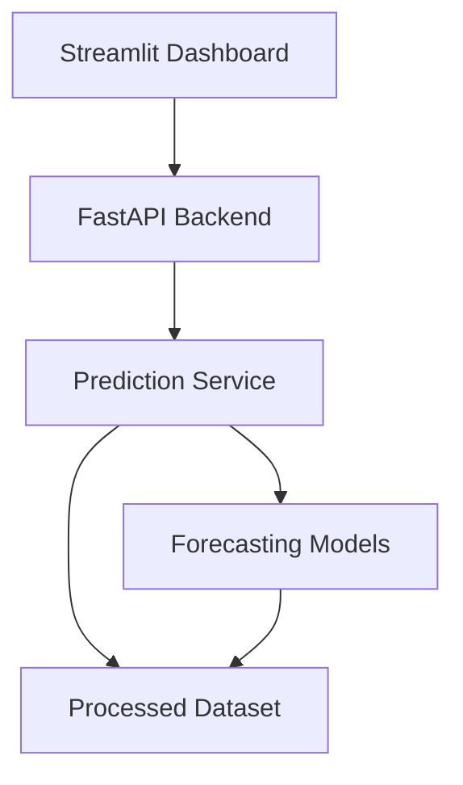
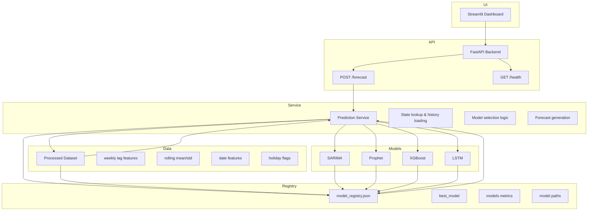

# Forecasting System Architecture Diagrams

## Surface-level Architecture

```mermaid
flowchart TD
    A[Streamlit Dashboard]
    B[FastAPI Backend]
    C[Prediction Service]
    D[Forecasting Models]
    E[Processed Dataset]

    A --> B
    B --> C
    C --> D
    C --> E
    D --> E
```

## Detailed Architecture

```mermaid
flowchart TD
    subgraph UI
        A[Streamlit Dashboard]
    end

    subgraph API
        B[FastAPI Backend]
        B1[POST /forecast]
        B2[GET /health]
    end

    subgraph Service
        C[Prediction Service]
        C1[State lookup & history loading]
        C2[Model selection logic]
        C3[Forecast generation]
    end

    subgraph Models
        D1[SARIMA]
        D2[Prophet]
        D3[XGBoost]
        D4[LSTM]
    end

    subgraph Data
        E[Processed Dataset]
        E1[weekly lag features]
        E2[rolling mean/std]
        E3[date features]
        E4[holiday flags]
    end

    subgraph Registry
        F[model_registry.json]
        F1[best_model]
        F2[models metrics]
        F3[model paths]
    end

    A --> B
    B --> B1
    B --> B2
    B1 --> C
    C --> D1
    C --> D2
    C --> D3
    C --> D4
    C --> E
    C --> F
    E --> F
    D1 --> F
    D2 --> F
    D3 --> F
    D4 --> F
    E --> C
    F --> C
```
